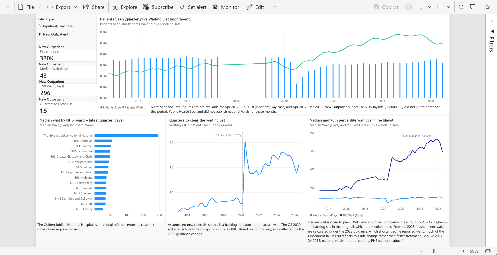
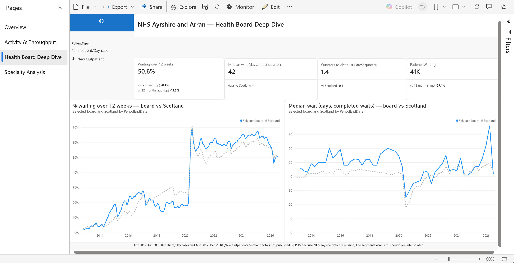
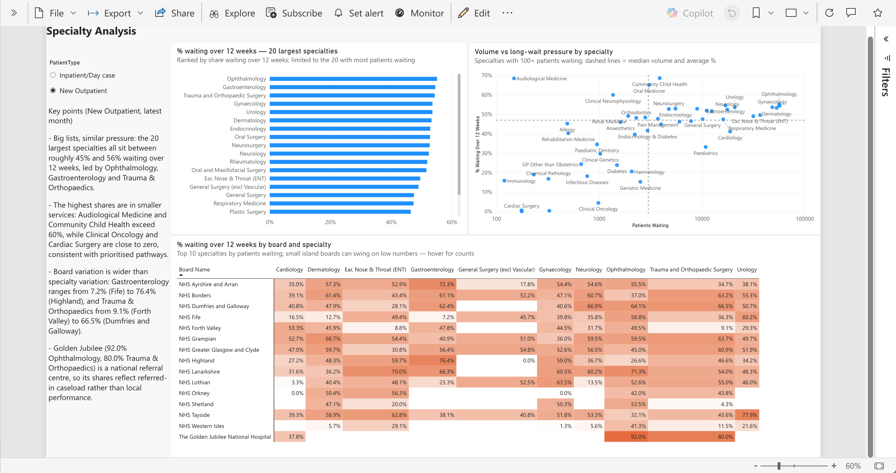

# NHS Scotland Waiting Times — Power BI Analysis & Report

## Why this project

Friends told me that getting hospital care in Scotland involves more waiting than treatment. That made me wonder: is this true across the country, or just at our local hospital? Are all specialties backed up, or only some? And has it always been like this, or is it a post-pandemic problem?

The longest waits are rarely in the waiting room. They happen before a patient is seen at all: weeks or months from referral to a first outpatient appointment, or from the decision to treat to admission for surgery. Public Health Scotland publishes these waits as open data, so I used them to build a Power BI report covering 2012 to June 2026.

## Key findings

- **The list is still far above pre-COVID levels.** It has fallen over the past year, but outpatient waits are up 84% and inpatient / day case waits are up 99% since February 2020.
- **Half or more wait over 12 weeks.** 50.7% of outpatients and 62.8% of inpatients / day cases, and the longest waits have grown much faster than the median.
- **It is not just one hospital.** Every regional health board has a large share waiting over 12 weeks, though levels vary widely, from around 29% to 71% for inpatients / day cases.
- **Orthopaedics and ophthalmology are the pressure points.** Both combine high shares waiting over 12 weeks with some of the largest lists.
- **Activity has recovered, but not enough.** At current activity it would take 1.5 quarters to clear the outpatient list and 2.3 quarters for inpatients / day cases, against about 0.6 in 2013.

The report is organised around five questions:

1. How long is the waiting list, and is it growing?
2. How long do patients wait?
3. Which health boards are under most pressure?
4. Which specialties wait longest?
5. Can the system keep up?

## Findings by question
 
All figures are NHS Scotland totals at the latest period in the data (30 June 2026) unless stated otherwise.
 
### 1. How long is the waiting list, and is it growing?
 
The list has started to fall over the past year, but it is still far above pre-COVID levels.
 
| | Waiting (Jun 2026) | vs 12 months ago | vs pre-COVID (Feb 2020) |
|---|---|---|---|
| New outpatients | 496,349 | −12.8% | +84.4% (from 269,222) |
| Inpatients / day cases | 157,191 | −1.2% | +98.9% (from 79,025) |
 
The outpatient list peaked at roughly 575,000 in 2024–25. The inpatient / day case list has almost doubled since February 2020 and has been broadly flat for the past year.
 
### 2. How long do patients wait?
 
| | % waiting over 12 weeks | Change vs 12 months ago |
|---|---|---|
| New outpatients | 50.7% (251,500 waits) | −8.2 pp |
| Inpatients / day cases | 62.8% (98,700 waits) | −3.1 pp |
 
For completed new outpatient waits in the latest quarter, the median was 43 days and the 90th percentile 296 days.
 
**The median hides the long tail.** The median wait is close to pre-COVID levels, but the 90th percentile is roughly 2.5–3× higher: the backlog sits with the patients who wait longest.
 
**Recent falls need care.** From 30 July 2025, PHS calculates waits under the Scottish Government's 2023 waiting times guidance, which allows a patient's clock to be reset after a cancellation or non-attendance even beyond 12 weeks. This shortens some reported waits. PHS's impact assessment shows that for inpatient / day case admissions, the 90th percentile fell by 45 days over the year to March 2026 as reported, but would have fallen by only 11 days under the old rules. The report marks this change on the trend chart rather than treating the fall as an improvement. See the [decision log](docs/decision-log.md).
 

 
### 3. Which health boards are under most pressure?
 
Board variation is wide. For inpatients / day cases, NHS Tayside has the highest share waiting over 12 weeks (around 71%), ahead of NHS Grampian (around 66%); NHS Western Isles is lowest (around 29%). For new outpatients the regional boards are closer together, with Tayside and Grampian both around 51–52%.
 
The Health Board Deep Dive page compares any board with Scotland. For example, NHS Ayrshire and Arran's outpatient list is 27.1% smaller than a year ago, and would take 1.4 quarters to clear at current activity, against 1.5 for Scotland.
 
The Golden Jubilee National Hospital is shown separately in the notes: it is a national referral centre, so its figures reflect the cases referred to it rather than local performance.
 

 
### 4. Which specialties wait longest?
 
Ophthalmology and Trauma & Orthopaedics are the pressure points, with both high shares waiting over 12 weeks and some of the largest lists.
 
| | New outpatients | Inpatients / day cases |
|---|---|---|
| Trauma & Orthopaedic Surgery | 3rd of 20 largest: 54.3% over 12 weeks, 57,144 waiting | **1st: 69.9%, 42,316 waiting** |
| Ophthalmology | **1st: 55.1%, 56,585 waiting** | 10th: 57.7%, 30,114 waiting |
 
Orthopaedics is under pressure at both stages; for ophthalmology the pressure is mainly at the outpatient stage. Variation between boards is wider than between specialties: for outpatient orthopaedics, the share waiting over 12 weeks ranges from 9.1% in NHS Forth Valley to 66.5% in NHS Dumfries and Galloway.
 

 
### 5. Can the system keep up?
 
Not yet. Activity has largely recovered since the pandemic, but the list has grown far beyond what current activity can clear.
 
**Quarters to clear the list** = patients waiting ÷ patients seen in the quarter, i.e. how many quarters of current activity it would take to clear the list if no new patients were added. It is a backlog indicator, not an actual wait.
 
| | 2013 | Jun 2026 |
|---|---|---|
| New outpatients | ~0.6 | 1.5 |
| Inpatients / day cases | ~0.6 | 2.3 |
 
The backlog relative to activity has more than doubled for outpatients and nearly quadrupled for inpatients / day cases. The sharpest jump came in Q2 2020, when activity collapsed during the first lockdown.
 
---
 
## Power BI report pages
 
| Page | Purpose | Main visuals |
|---|---|---|
| 1. Overview | Size and direction of the list (Q1, Q2) | KPI cards with 12-month and pre-COVID comparisons; waiting list trend from 2012 with COVID marker; % over 12 weeks by board |
| 2. Activity & Throughput | Waits and capacity (Q2, Q5) | Patients seen vs waiting list; median and 90th percentile trend with 2023 guidance marker; quarters to clear trend; median by board |
| 3. Health Board Deep Dive | One board vs Scotland (Q3) | Drillthrough from any board visual; dynamic title; KPI cards vs Scotland and vs 12 months ago; board vs Scotland trends |
| 4. Specialty Analysis | Specialty pressure (Q4) | Top 20 specialties by share over 12 weeks; volume vs share scatter (log scale); board × specialty heatmap |
 
A patient type slicer (new outpatients / inpatients and day cases) is synced across pages.
 
---
 
## Data
 
**Source:** [Public Health Scotland open data](https://www.opendata.nhs.scot/dataset/stage-of-treatment-waiting-times), Stage of Treatment Waiting Times, under the [Open Government Licence v3.0](https://www.nationalarchives.gov.uk/doc/open-government-licence/version/3/).
 
| File | Grain | Used for |
|---|---|---|
| Ongoing waits | Month-end, by health board, specialty and patient type | Patients waiting, waits over 12 weeks |
| Completed waits | Quarter, by health board, specialty and patient type | Patients seen, median and 90th percentile wait |
| Health board and specialty lookups | Reference | Board names and types, specialty names |
 
Column definitions, qualifier codes (`:`, `u`, `p`, `b` and others) and how suppressed values are handled are in the [data dictionary](docs/data-dictionary.md).
 
---
 
## How it is built
 
```
PHS open data (CSV)
   │  ingestion/download_phs_data.py
   ▼
data/bronze/<table>/<table>.csv  (committed to GitHub)
   │  Power Query: fnLoadBronzeTable reads from raw.githubusercontent.com
   ▼
Fact_OngoingWaits, Fact_CompletedWaits  (cleaned, PeriodEndDate added, column names unified)
   │
   ▼
Star schema + DAX measures  →  Power BI report
```
 
The bronze CSVs are committed to the repository because the PHS open data portal had an outage during development and the Azure subscription used for storage was disabled. Reading from GitHub keeps the report refreshable from a stable source.
 
### Data model
 
- **Facts:** `Fact_OngoingWaits` (monthly) and `Fact_CompletedWaits` (quarterly).
- **Shared dimensions:** `Dim_Period`, `Dim_PatientType`, `Dim_HealthBoard` (board name and type: regional, special, Scotland), `Dim_Specialty`. Each relates one-to-many, single direction, to both facts.
- **Reference tables:** `Ref_HealthBoard`, `Ref_Specialty` (hidden, no relationships), used to build the dimensions.
### DAX design
 
PHS publishes Scotland and all-specialty totals as separate rows, so measures must not simply sum everything. The core measures follow one pattern:
 
- Default to the **latest period**, or the period on the axis in a trend chart.
- Use the **Scotland total row** unless a board is filtered, and the **all-specialties row** unless a specialty is filtered.
- Return **BLANK, not 0,** when PHS has suppressed or not published a value.
On top of this:
 
- **Benchmark measures** compare a board with Scotland, with 12 months earlier, and with a pre-COVID baseline (February 2020).
- **Median and 90th percentile** are taken from the PHS published values and require a single patient type, since medians cannot be combined.
- **Quarters to Clear** aligns two grains: the monthly waiting list is evaluated at the latest quarter end in the completed waits table, so a new monthly release never gets divided by the previous quarter's activity.
Each of these choices is explained in the [decision log](docs/decision-log.md).
 
---
 
## Data quality and caveats
 
- **Missing national totals, Apr 2017 – Dec 2018.** NHS Tayside did not submit data, so PHS did not publish Scotland totals (Apr 2017–Jun 2018 for inpatients / day cases, Apr 2017–Dec 2018 for new outpatients). Charts show this gap with a note; lines across it are interpolated.
- **Methodology change, Jul 2025.** Wait lengths since 30 July 2025 follow the 2023 guidance and are not directly comparable with earlier periods. List sizes and activity counts are unaffected.
- **Waits, not people.** A patient waiting on more than one list is counted more than once, so outpatient and inpatient lists should not be added together to estimate the number of people affected.
- **Series start.** The inpatient / day case series looks incomplete in late 2012 (the list roughly doubles within a few months); this is being checked against PHS metadata.
- **Small boards.** Island boards can show large swings in percentages because the numbers involved are small.
---

**Tools:** Power BI Service (Power Query / M, DAX, star schema), Python for ingestion, Git/GitHub for version control (model stored as TMDL).

---
 
## Disclaimer

This is an independent portfolio project. It is not affiliated with, endorsed by or produced for Public Health Scotland, NHS Scotland or the Scottish Government.

Contains public sector information licensed under the [Open Government Licence v3.0](https://www.nationalarchives.gov.uk/doc/open-government-licence/version/3/). Source: Public Health Scotland, Stage of Treatment Waiting Times.

Figures reflect the data as downloaded (latest period: 30 June 2026). PHS revises published statistics over time, so numbers here may differ from current official releases. The analysis and interpretations are my own. For official figures, see [Public Health Scotland's waiting times publications](https://publichealthscotland.scot/publications/stage-of-treatment-waiting-times/).

This report is for learning and demonstration only and should not be used to make decisions about individual care.